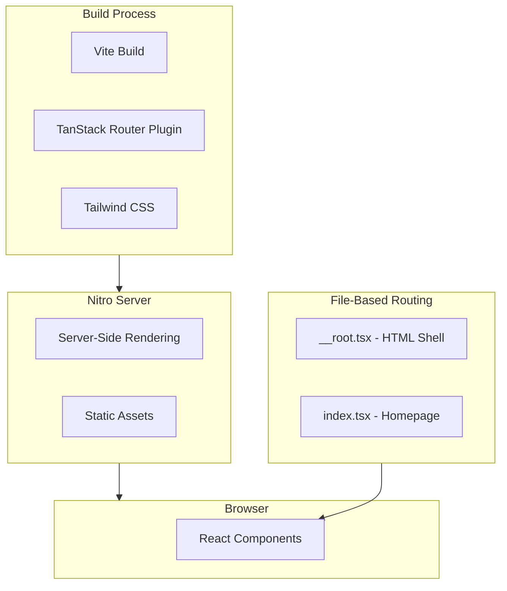
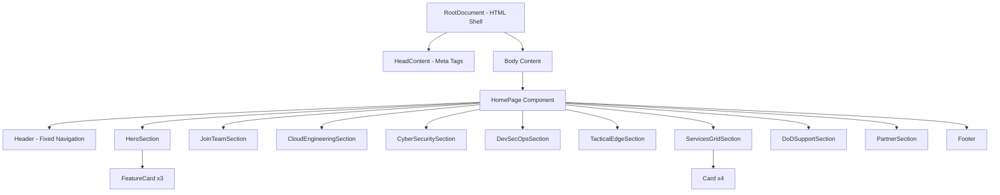

# TanStack Start Landing Page - Architecture & Clone Guide

This document provides a comprehensive overview of the McQueen Solutions landing page architecture and serves as a guide for creating new similar sites (e.g., McQueen Logistics).

## Table of Contents

1. [Technology Stack](#technology-stack)
2. [Project Structure](#project-structure)
3. [Architecture Overview](#architecture-overview)
4. [Key Files Explained](#key-files-explained)
5. [Customization Guide](#customization-guide)
6. [Clone & Create New Site](#clone--create-new-site)

---

## Technology Stack

| Technology | Purpose | Version |
|------------|---------|---------|
| **TanStack Start** | Full-stack React framework with SSR | ^1.132.0 |
| **TanStack Router** | File-based routing with type safety | ^1.132.0 |
| **React** | UI library | ^19.2.0 |
| **Vite** | Build tool and dev server | ^7.1.7 |
| **Tailwind CSS v4** | Utility-first CSS framework | ^4.0.6 |
| **shadcn/ui** | Component library (New York style) | - |
| **Lucide React** | Icon library | ^0.561.0 |
| **Biome** | Linting and formatting | 2.2.4 |
| **Nitro** | Server runtime | nightly |
| **pnpm** | Package manager | - |

---

## Project Structure

```
mcqueen-solutions/
├── public/                    # Static assets
│   ├── favicon.ico
│   ├── logo192.png
│   ├── logo512.png
│   ├── manifest.json
│   └── robots.txt
├── src/
│   ├── components/            # React components
│   │   ├── Header.tsx         # Site header with logo
│   │   └── ui/                # shadcn/ui components
│   │       ├── button.tsx
│   │       └── card.tsx
│   ├── lib/
│   │   └── utils.ts           # Utility functions (cn helper)
│   ├── routes/                # TanStack Router file-based routes
│   │   ├── __root.tsx         # Root layout (HTML shell, meta tags)
│   │   └── index.tsx          # Homepage with all sections
│   ├── router.tsx             # Router configuration
│   ├── routeTree.gen.ts       # Auto-generated route tree (DO NOT EDIT)
│   └── styles.css             # Global styles + Tailwind + CSS variables
├── biome.json                 # Linting/formatting config
├── components.json            # shadcn/ui configuration
├── Dockerfile                 # Multi-stage Docker build
├── package.json               # Dependencies and scripts
├── tsconfig.json              # TypeScript configuration
└── vite.config.ts             # Vite + TanStack Start config
```

---

## Architecture Overview



### Request Flow

1. **Development**: `pnpm dev` starts Vite dev server on port 3000
2. **Build**: `pnpm build` creates optimized production build in `.output/`
3. **Production**: `pnpm start` runs the Nitro server serving SSR content

### Component Architecture



---

## Key Files Explained

### [`vite.config.ts`](../vite.config.ts)

Configures the build system with essential plugins:

```typescript
plugins: [
  devtools(),           // TanStack devtools
  nitro(),              // Server runtime
  viteTsConfigPaths(),  // Path alias support (@/)
  tailwindcss(),        // Tailwind CSS v4
  tanstackStart(),      // TanStack Start framework
  viteReact(),          // React support
]
```

### [`src/routes/__root.tsx`](../src/routes/__root.tsx)

The root layout that wraps all pages:

- **`head()`**: Defines meta tags, title, and stylesheet links
- **`shellComponent`**: The HTML document structure
- Includes TanStack devtools (development only)

### [`src/routes/index.tsx`](../src/routes/index.tsx)

The homepage containing all landing page sections:

- Uses `createFileRoute("/")` for the root path
- Composed of multiple section components
- Each section is a self-contained functional component

### [`src/styles.css`](../src/styles.css)

Global styles with CSS custom properties:

- **Brand colors**: `--mcqueen-red` and `--mcqueen-dark`
- **shadcn/ui theme**: Full light/dark mode support
- **Tailwind v4**: Uses `@theme inline` for custom properties

### [`src/components/Header.tsx`](../src/components/Header.tsx)

Fixed navigation header with brand logo treatment:

- Uses TanStack Router's `Link` component
- Brand name split into colored segments

---

## Customization Guide

### 1. Brand Colors

Edit [`src/styles.css`](../src/styles.css:21-25):

```css
:root {
  --mcqueen-red: #c41230;    /* Primary brand color */
  --mcqueen-dark: #0a1628;   /* Dark background color */
}
```

These are exposed as Tailwind classes: `bg-mcqueen-red`, `text-mcqueen-red`, `bg-mcqueen-dark`

### 2. Site Title & Meta

Edit [`src/routes/__root.tsx`](../src/routes/__root.tsx:19-21):

```typescript
{
  title: "McQueen Solutions - Innovative Solutions for Data Science",
}
```

### 3. Header/Logo

Edit [`src/components/Header.tsx`](../src/components/Header.tsx:8-14):

```tsx
<span className="text-mcqueen-red font-bold text-xl tracking-tight">
  MCQUEEN
</span>
<span className="text-gray-400 font-light text-xl">|</span>
<span className="text-gray-400 font-light text-xl tracking-wide">
  Solutions
</span>
```

### 4. Hero Section Content

Edit [`src/routes/index.tsx`](../src/routes/index.tsx:61-69):

```tsx
<h1>Innovative Solutions for Data Science</h1>
<p>McQueen Solutions provides enhanced mission capabilities...</p>
```

### 5. Feature Cards

Edit the `FeatureCard` components in [`src/routes/index.tsx`](../src/routes/index.tsx:74-89):

```tsx
<FeatureCard
  icon={<Code className="size-8 text-mcqueen-red" />}
  title="Code"
  description="..."
/>
```

### 6. Service Sections

Each section (Cloud, Cyber, DevSecOps, Tactical) follows the same pattern:
- Alternating layout (image left/right)
- Title + description
- Icon illustration

### 7. Footer

Edit [`src/routes/index.tsx`](../src/routes/index.tsx:360-381):

```tsx
<p>© {new Date().getFullYear()} · McQueen Solutions. All rights reserved.</p>
```

### 8. Public Assets

Replace files in `public/`:
- `favicon.ico` - Browser tab icon
- `logo192.png` - PWA icon (192x192)
- `logo512.png` - PWA icon (512x512)
- `manifest.json` - PWA manifest (update name, colors)

---

## Clone & Create New Site

### Step 1: Clone the Repository

```bash
# Clone the template
git clone <repo-url> mcqueen-logistics
cd mcqueen-logistics

# Remove git history for fresh start
rm -rf .git
git init
```

### Step 2: Update Package Identity

Edit [`package.json`](../package.json:2):

```json
{
  "name": "mcqueen-logistics",
  ...
}
```

### Step 3: Update Brand Colors

Edit [`src/styles.css`](../src/styles.css:24-25):

```css
:root {
  --mcqueen-red: #YOUR_PRIMARY_COLOR;
  --mcqueen-dark: #YOUR_DARK_COLOR;
}
```

Consider renaming the CSS variables for clarity:
```css
--brand-primary: #YOUR_COLOR;
--brand-dark: #YOUR_DARK;
```

Then update all usages: `text-mcqueen-red` → `text-brand-primary`

### Step 4: Update Site Metadata

Edit [`src/routes/__root.tsx`](../src/routes/__root.tsx:19-21):

```typescript
{
  title: "McQueen Logistics - Your Tagline Here",
}
```

### Step 5: Update Header

Edit [`src/components/Header.tsx`](../src/components/Header.tsx):

```tsx
<span className="text-brand-primary font-bold text-xl">MCQUEEN</span>
<span className="text-gray-400 font-light text-xl">|</span>
<span className="text-gray-400 font-light text-xl">Logistics</span>
```

### Step 6: Update Content Sections

Edit [`src/routes/index.tsx`](../src/routes/index.tsx) - update each section:

1. **HeroSection**: Main headline and description
2. **FeatureCards**: Three key value propositions
3. **Service Sections**: Cloud, Cyber, DevSecOps, Tactical (or your services)
4. **ServicesGridSection**: Detailed service cards
5. **DoDSupportSection**: Banner text
6. **PartnerSection**: CTA section
7. **Footer**: Company name and links

### Step 7: Update Public Assets

Replace in `public/`:
- `favicon.ico`
- `logo192.png`
- `logo512.png`
- Update `manifest.json` with new name and theme colors

### Step 8: Install & Test

```bash
pnpm install
pnpm dev
```

### Step 9: Build & Deploy

```bash
pnpm build
pnpm start  # Test production build locally

# Or use Docker
docker build -t mcqueen-logistics .
docker run -p 3000:3000 mcqueen-logistics
```

---

## Development Commands

| Command | Description |
|---------|-------------|
| `pnpm dev` | Start development server on port 3000 |
| `pnpm build` | Build for production |
| `pnpm start` | Run production server |
| `pnpm preview` | Preview production build |
| `pnpm test` | Run tests with Vitest |
| `pnpm format` | Format code with Biome |
| `pnpm lint` | Lint code with Biome |
| `pnpm check` | Run all Biome checks |

---

## Adding New UI Components

This project uses [shadcn/ui](https://ui.shadcn.com/) with the New York style.

```bash
# Add a new component
npx shadcn@latest add <component-name>

# Examples
npx shadcn@latest add dialog
npx shadcn@latest add form
npx shadcn@latest add input
```

Components are added to `src/components/ui/` and can be customized.

---

## Docker Deployment

The included [`Dockerfile`](../Dockerfile) uses a multi-stage build:

1. **deps**: Install dependencies with pnpm
2. **builder**: Build the application
3. **runner**: Minimal production image

```bash
# Build image
docker build -t mcqueen-site .

# Run container
docker run -p 3000:3000 mcqueen-site
```

---

## Quick Reference: What to Change for New Site

| Item | File | Line(s) |
|------|------|---------|
| Package name | `package.json` | 2 |
| Brand colors | `src/styles.css` | 24-25 |
| Site title | `src/routes/__root.tsx` | 20 |
| Header logo | `src/components/Header.tsx` | 8-14 |
| Hero content | `src/routes/index.tsx` | 61-69 |
| Feature cards | `src/routes/index.tsx` | 74-89 |
| Service sections | `src/routes/index.tsx` | 134-245 |
| Services grid | `src/routes/index.tsx` | 268-293 |
| Footer | `src/routes/index.tsx` | 360-381 |
| PWA manifest | `public/manifest.json` | all |
| Favicon/logos | `public/` | - |
